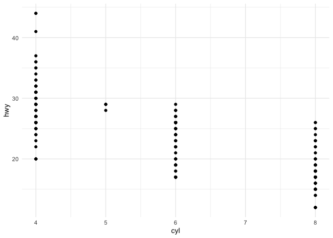
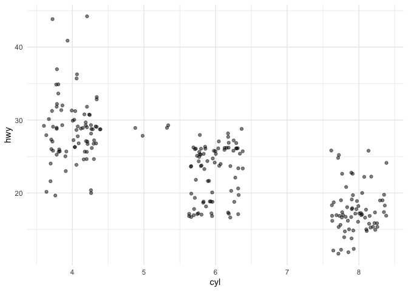
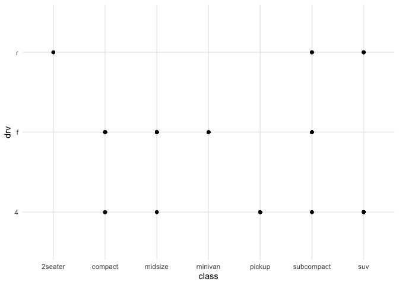
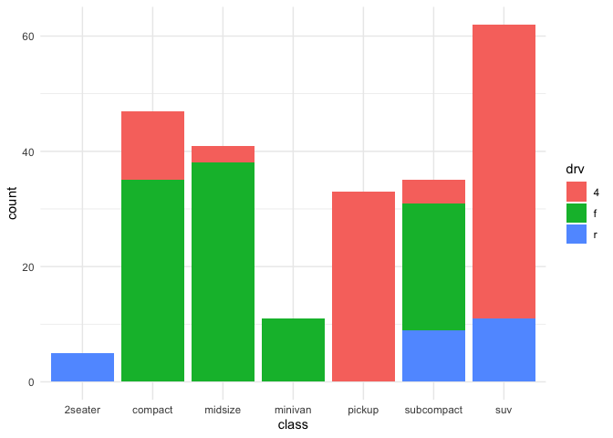

R for Data Science Day 1
================
Darya Vanichkina
2019-12-04

I am incredibly excited that RStudio has begun an [instructor
certification program](https://education.rstudio.com/trainers/) based on
the Carpentries, so of course I signed up as soon as my overcommited
nature allowed\! This also provides me with the excuse and motivation to
finally formally work my way through [R for Data
Science](https://r4ds.had.co.nz/), a book I have read while waiting for
GTT tests during my pregnancy and google-landed upon an umpteen number
of times while debugging code, but never taken the time to sit down and
do the exercises for - and of course the pedagogue in me knows quite
well that THAT is how you actually learn and internalise the principles
and concepts in any material, especially if it deals with programming
and analysis. So over the next few weeks I plan to work my way through
R4DS, and this post is the first in which I dive into the exercises.

## Notes on 1 Introduction

Steps of the data
pipeline:


  - **Import**: take data stored in a file, database, or web API, and
    load it into a data frame in R.

### Wrangling:

  - **Tidying** - storing data in a consistent form that matches the
    semantics of the dataset with the way it is stored. In brief, when
    your data is tidy, each column is a variable, and each row is an
    observation.

  - **Transformation**
    
      - narrowing in on observations of interest (like all people in one
        city, or all data from the last year),
      - creating new variables that are functions of existing variables
        (like computing speed from distance and time),
      - calculating a set of summary statistics (like counts or means).
        Together, tidying and transforming are called wrangling

## Small data vs big data

  - Small/medium data: hundreds of megabytes of data, and with a little
    care up to 1-2 Gb of data.
  - If you’re routinely working with larger data (10-100 Gb, say), you
    should learn more about data.table.

## Is big data really big? Two ways of thinking small about big data

### Sampling

Sampling may be enough to answer the
question.

### Your vig data problem is actually a large number of small data problems

  - Each individual problem might fit in memory, but you have millions
    of them. For example, you might want to fit a model to each person
    in your dataset. That would be trivial if you had just 10 or 100
    people, but instead you have a million.
  - So you need a system (like Hadoop or Spark) that allows you to send
    different datasets to different computers for processing.
  - Once you’ve figured out how to answer the question for a single
    subset using the tools described in this book, you can use tools
    like sparklyr, rhipe, and ddr to solve it for the full dataset.

## Notes on 2 Introduction

Data exploration is the art of looking at your data, rapidly generating
hypotheses, quickly testing them, then repeating again and again and
again.

-----

## Exercises on 3 Data Visualisation

### 3.2.4 Exercises

1.  Run ggplot(data = mpg). What do you
    see?

<!-- end list -->

``` r
library(tidyverse)
```

    ## ── Attaching packages ─────────────────────────────────────────────────────────── tidyverse 1.3.0 ──

    ## ✓ ggplot2 3.2.1     ✓ purrr   0.3.3
    ## ✓ tibble  2.1.3     ✓ dplyr   0.8.3
    ## ✓ tidyr   1.0.0     ✓ stringr 1.4.0
    ## ✓ readr   1.3.1     ✓ forcats 0.4.0

    ## ── Conflicts ────────────────────────────────────────────────────────────── tidyverse_conflicts() ──
    ## x dplyr::filter() masks stats::filter()
    ## x dplyr::lag()    masks stats::lag()

``` r
ggplot(data = mpg)
```

<!-- -->

Nothing, because we haven’t selected a geom.

2.  How many rows are in mpg? How many columns?

<!-- end list -->

``` r
nrow(mpg)
```

    ## [1] 234

``` r
ncol(mpg)
```

    ## [1] 11

``` r
dim(mpg)
```

    ## [1] 234  11

3.  What does the drv variable describe? Read the help for ?mpg to find
    out.

<!-- end list -->

``` r
?mpg
```

  - f = front-wheel drive, r = rear wheel drive, 4 = 4wd

4.Make a scatterplot of hwy vs cyl.

``` r
# set all ggplot figures to use minimal theme
theme_set(theme_minimal())
mpg %>%
  ggplot(aes(x = cyl, y = hwy)) + geom_point()
```

<!-- -->

``` r
# use transparency and jitter to make the points separate better
mpg %>%
  ggplot(aes(x = cyl, y = hwy)) + geom_jitter(width = 0.4, alpha = 0.5)
```

<!-- -->

5.  What happens if you make a scatterplot of class vs drv? Why is the
    plot not useful?

<!-- end list -->

``` r
theme_set(theme_minimal())
mpg %>%
  ggplot(aes(x = class, y = drv)) + geom_point()
```

<!-- -->

Because it is plotting a category vs a category, so most of the space in
the plot cannot be filled. However, I’d argue that it’s not completely
useless as it does show that all 2 seater cars have rear wheel drive,
while all minivans have forward wheel drive.

The barplot below probably presents a better visualisation, as it also
shows that we may not have sampled enough 2 seater vehicles to identify
whether any of them could possibly have forward drive. Having said that,
I do like the dot-plot visualisation as well.

``` r
theme_set(theme_minimal())
mpg %>%
  ggplot(aes(x = class, fill = drv)) + geom_bar()
```

<!-- -->

-----

3.3.1
